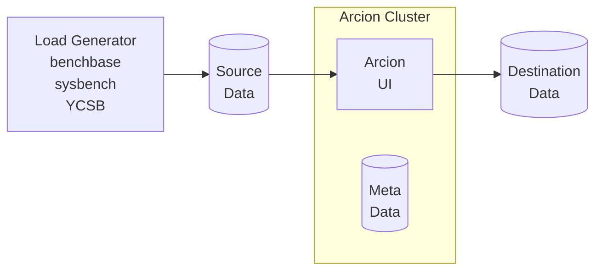

These are Docker Compose files used for Data source and Data destination in [Demo Load Generator](https://github.com/arcionlabs/arcion-demo) and Release Testing.
The diagram below depicts the components of the demo kit where where the Docker Compose files fit in.

- Load Generator
- Data source
- Arcion host with dedicated metadata database
- Data destination



# Getting started

- Clone this repo (one time)

    ```bash
    git clone https://github.com/arcionlabs/docker-dev 
    cd docker-dev
    git fetch
    ```

- Create Docker network (one time)

    ```bash
    docker network create arcnet
    ```

- Start Arcion

    ```bash
    docker compose -f arcion-demo/docker-compose.yaml up -d
    ```

- Start one or more of Data source and destinations

  An examaple of starting MySQL, PostgreSQL, Open Source Kakfa

    ```bash
    docker compose -f mysql/docker-compose.yaml up -d
    docker compose -f kafka/docker-compose.yaml up -d
    docker compose -f postgresql/docker-compose.yaml up -d
    ```

- Generate data and activity for testing using Arcion CLI

    go to http://localhost:7681

    each will run for 5 minutes and times out

    ```bash
    arcdemo.sh full mysql oskafka
    arcdemo.sh full mysql postgresql
    arcdemo.sh full postgresql mysql
    arcdemo.sh full postgresql oskafka
    ```
- Use Arcion UI

    go to http://localhost:8080 and sign in with user `admin` password `arcion`


