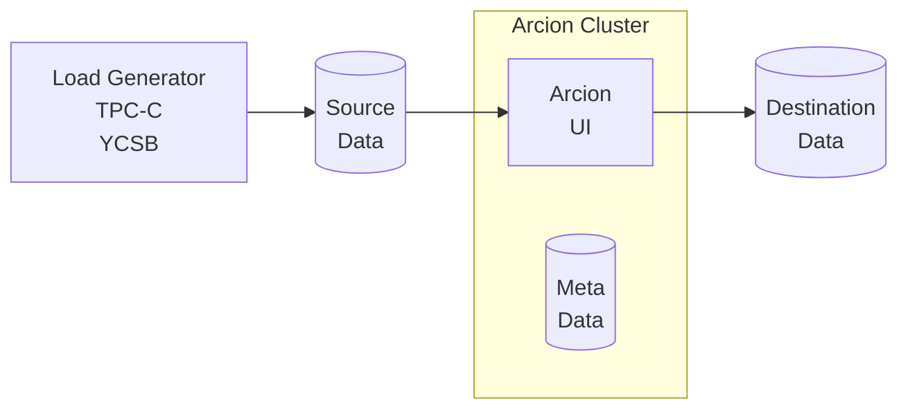

This is Arcion Demo Kit. This is design to demo and test Arcion replication from various data source to target. The diagram below describes the components of the demo kit.  Please refer to [https://docs.arcion.io](https://docs.arcion.io) for more info.

- Load Generator
- Data source
- Arcion host with dedicated metadata database
- Data destination



# Getting started

Assumptions:

- Running on Windows WSL, Liunx, Mac (Intel and Apple Silicon)
- Have Arcion License in the current directory (replicant.lic) 
- Have Docker and git installed
- Have access to a terminal and a browser

# Install Demo Kit  

Cut and paste the following in a terminal.

```
/bin/bash -c "$(curl -fsSL https://raw.githubusercontent.com/arcionlabs/docker-dev/HEAD/install.sh)"
```

# Using Demo Kit

## CLI

The demo kit uses `tmux`.  Based on your preference, use one or both methods below.  Both views will be in sync.

- using a browser: `http://localhost:7681`
- using a terminal: `docker exec -it workloads tmux attach`

## UI

Go to [http://localhost:8080](http://localhost:8080) and sign in with user `admin` password `arcion`

# Running a demo with CLI

each will run for 5 minutes and times out by default

```bash
arcdemo.sh full mysql oskbroker
arcdemo.sh full postgresql minio
arcdemo.sh full postgresql mysql
arcdemo.sh full mysql postgresql
```

### Change Scale Factor Performance and Scale Tests

- For 1GB volume test, change the scale factor to 10

    go to http://localhost:7681

    each will run for 5 minutes and times out by default

    scale factor 10 will generate about 1GB of data on YCSB and 1GB TPC-C

    ```bash
    arcdemo.sh -s 10 full mysql oskbroker
    arcdemo.sh -s 10 full postgresql minio
    arcdemo.sh -s 10 full postgresql mysql
    arcdemo.sh -s 10 full mysql postgresql
    ```

- For 10GB volume test, change the scale factor to 100

    go to http://localhost:7681

    each will run for 5 minutes and times out

    scale factor 100 will generate about 10GB of data on YCSB and 1GB of TPC-C
    set snapshot inter table parallelism to 2 on the extractor and 2 on the applier

    ```bash
    arcdemo.sh -s 100 -b 2:2 full mysql oskbroker
    arcdemo.sh -s 100 -b 2:2 full mysql postgresql
    arcdemo.sh -s 100 -b 2:2 full postgresql mysql
    arcdemo.sh -s 100 -b 2:2 full postgresql oskbroker
    ```

- For stresing out CDC, change the workload update rate and increase threads on Arcion real-time threads

    ```bash
    arcdemo.sh -s 100 -b 2:2 -r 2:2 -t 0 full mysql oskbroker
    arcdemo.sh -s 100 -b 2:2 -r 2:2 -t 0 full mysql postgresql
    arcdemo.sh -s 100 -b 2:2 -r 2:2 -t 0 full postgresql mysql
    arcdemo.sh -s 100 -b 2:2 -r 2:2 -t 0 full postgresql oskbroker
    ```

    `-r 2:2` use 2 threads respectively for Arcion real-time extractor and applier 
    `-t 0`   run YCSB on 1 thread and TPC-C on 1 thread as fast as possible 
    
## To shutdown all data source and destination providers

```bash
for db in $( find * -maxdepth 1 -type d -prune ! -name "arcion*" ); do
pushd $db; docker compose down; popd
done
```


# Cloud Database Examples

## Snowflake

- Snowflake source to MySQL destination
use default on mysql destination

single thread each extractor and applier
source catalog is SNOWFLAKE_SAMPLE_DATA and source schema is TPCH_SF1

```bash
SRCDB_DB=SNOWFLAKE_SAMPLE_DATA SRCDB_SCHEMA=TPCH_SF1 arcdemo.sh snapshot snowflake mysql
```

two threads each extractor and applier
source catalog is default `arcsrc` and source schema is `PUBLIC`
```bash
arcdemo.sh -b 2:2 snpashot snowflake mysql
```

# Oracle Docker Setup

Oracle requires container images to be build locally.
Start with Oracle XE, then use Oracle EE for volume testing.
Oracle XE does not require the extra step of download the Oracle EE binary.
Oracle EE should be used for anything scale factor beyond 10.

### Oracle XE

- Build the image

    ```bash
    cd oraxe
    git clone https://github.com/oracle/docker-images oracle-docker-images
    pushd oracle-docker-images/OracleDatabase/SingleInstance/dockerfiles 
    ./buildContainerImage.sh -v 21.3.0 -x -o '--build-arg SLIMMING=false'
    popd
    cd ..
    ```

- Start service

    ```bash
    docker compose -f oraxe/docker-compose.yaml up -d
    ``` 

- A test examples

    Scale factor 10 
    Snapshot inter table parallelism of 2

    ```bash
    arcdemo.sh -s 10 -b 2:2 full oraxe postgresql
    ```