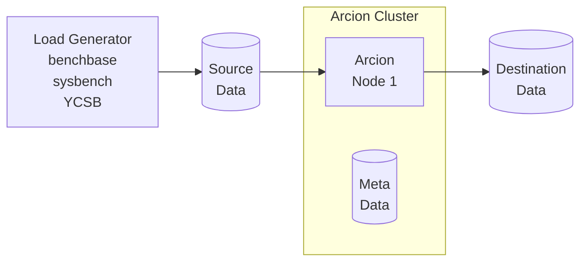

# docker-dev

These are Docker Compose files used for Data source and Data destination in [Demo Load Generator](https://github.com/arcionlabs/arcion-demo) and Release Testing.
The diagram below depicts the components of the demo kit where where the Docker Compose files fit in.

- Load Generator
- Data source
- Arcion host with dedicated metadata database
- Data destination



# Getting started

- Clone this repo

    ```bash
    git clone https://github.com/arcionlabs/docker-dev 
    cd docker-dev
    ```

- Create Docker network

    ```bash
    docker network create arcnet
    ```

- Start one or more of Data source and destinations

  - Examaple of starting Kakfa

    ```bash
    cd kakfa
    docker compose up -d
    ```

  - Examaple of stopping Kakfa

    ```bash
    cd kakfa
    docker compose down
    ```

  - Examaple of logs from Kakfa

    ```bash
    cd kakfa
    docker logs
    ```