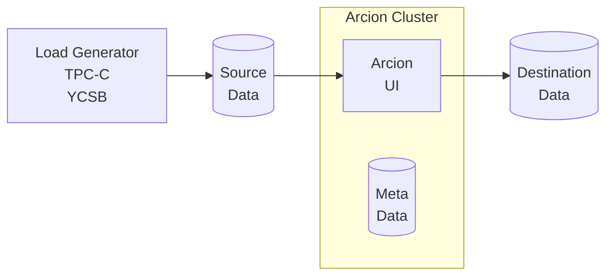

This is the Arcion Demo Kit. It is designed to demo and test Arcion replication from various data sources to targets. The diagram below describes the components of the demo kit.  Please refer to [https://docs.arcion.io](https://docs.arcion.io) for more info.

- Load Generator
- Data source
- Arcion host with the dedicated metadata database
- Data destination



# Getting started

Assumptions:

- Running on Windows WSL2, Liunx, Mac (Intel and Apple Silicon)
- Have Arcion License $ARCION_LICENSE defined or `replicant.lic` in the current directory 
- Have Docker and git installed
- Have access to a terminal and a browser

# Install Demo Kit  

Cut and paste the following in a terminal.

- run the latest
```
/bin/bash -c "$(curl -k -fsSL https://raw.githubusercontent.com/arcionlabs/docker-dev/HEAD/install.sh)"
```

- to run a specific tag
```bash
export ARCION_WORKLOADS_TAG=23.07
/bin/bash -c "$(curl -k -fsSL https://raw.githubusercontent.com/arcionlabs/docker-dev/${ARCION_WORKLOADS_TAG:-HEAD}/install.sh)"
```

[](https://asciinema.org/a/587770)

# Demo Recordings

Arcion supports snapshot, real-time, snapshot, and delta-snapshot replication modes.
Recorded Arcion CLI demos of source, destination, and replication type combination is available.
The recordings use `asciinema` so that the YAML config files can be cut/pasted.
This is a functional demo using TPCC and YCSB.
The data size is 1GB each, 1 thread given to Arcion, and 8 GB of RAM shared.  

- The source is on the left side of the table (the left column).
- The destination is on the right side of the table (the top row).
- The cell has workloads and URL to the demo.
- A blank cell means a demo has not been recorded as of yet.
   
## Snapshot Replication CLI Demos

snapshot | kafka | minio | mysql | null | oracle | pg | redis stream | snowflake
-- | -- | -- | -- | -- | -- | -- | -- | --
db2 luw | [TPCC, YCSB](https://asciinema.org/a/596930) | [TPCC, YCSB](https://asciinema.org/a/596933) | [TPCC, YCSB](https://asciinema.org/a/596925) | [TPCC, YCSB](https://asciinema.org/a/596934) | [TPCC, YCSB](https://asciinema.org/a/596927) | [TPCC, YCSB](https://asciinema.org/a/596926) | [TPCC, YCSB](https://asciinema.org/a/596929) | [TPCC, YCSB](https://asciinema.org/a/596928)
informix | [TPCC, YCSB](https://asciinema.org/a/596949) | [TPCC, YCSB](https://asciinema.org/a/596417) | [TPCC, YCSB](https://asciinema.org/a/596950) | [TPCC, YCSB](https://asciinema.org/a/596416) | [TPCC, YCSB](https://asciinema.org/a/596952) | [TPCC, YCSB](https://asciinema.org/a/596953) | [TPCC, YCSB](https://asciinema.org/a/596955) | [TPCC, YCSB](https://asciinema.org/a/596415)
mysql | [TPCC, YCSB](https://asciinema.org/a/596940) | [TPCC, YCSB](https://asciinema.org/a/596938) | [TPCC, YCSB](https://asciinema.org/a/596941) | [TPCC, YCSB](https://asciinema.org/a/596942) | [TPCC, YCSB](https://asciinema.org/a/596943) | [TPCC, YCSB](https://asciinema.org/a/596937) | [TPCC, YCSB](https://asciinema.org/a/596948) | [TPCC, YCSB](https://asciinema.org/a/M27aYd5QkOStjN80Pdqx2hBCc)
oracle | [TPCC, YCSB](https://asciinema.org/a/596635) | [TPCC, YCSB](https://asciinema.org/a/596638) | [TPCC, YCSB](https://asciinema.org/a/596642) | [TPCC, YCSB](https://asciinema.org/a/596643) | [TPCC, YCSB](https://asciinema.org/a/596958) | [TPCC, YCSB](https://asciinema.org/a/596641) | [TPCC, YCSB](https://asciinema.org/a/596957) | [TPCC, YCSB](https://asciinema.org/a/596634)
pg | [TPCC, YCSB](https://asciinema.org/a/596959) | [TPCC, YCSB](https://asciinema.org/a/596960) | [TPCC, YCSB](https://asciinema.org/a/596962) | [TPCC, YCSB](https://asciinema.org/a/596963) |   | [TPCC, YCSB](https://asciinema.org/a/596961) |   | [TPCC, YCSB](https://asciinema.org/a/596966)


## Full Replication CLI Demos

full | kafka | minio | mysql | null | oracle | pg | redis stream | snowflake
-- | -- | -- | -- | -- | -- | -- | -- | --
db2 luw |   |   | [TPCC YCSB](https://asciinema.org/a/597115) |   | [TPCC YCSB](https://asciinema.org/a/597114) | [TPCC YCSB](https://asciinema.org/a/597116) |   |  
informix | [YCSB](https://asciinema.org/a/596970) | [YCSB](https://asciinema.org/a/596971) | [YCSB](https://asciinema.org/a/596959) | [YCSB](https://asciinema.org/a/596973) | [YCSB](https://asciinema.org/a/46fe1mFKWyIvRhSaqEnIrGacN),[YCSB](https://asciinema.org/a/596974) | [YCSB](https://asciinema.org/a/596418),[YCSB](https://asciinema.org/a/596975) | [YCSB](https://asciinema.org/a/596977) | [YCSB](https://asciinema.org/a/596402)
mysql | [TPCC YCSB](https://asciinema.org/a/596184) | [TPCC YCSB](https://asciinema.org/a/596183) | [TPCC YCSB](https://asciinema.org/a/596980) | [TPCC YCSB](https://asciinema.org/a/596979) | [TPCC YCSB](https://asciinema.org/a/596981) | [TPCC YCSB](https://asciinema.org/a/587771) | [TPCC YCSB](https://asciinema.org/a/596982) | [TPCC YCSB]()
oracle | [TPCC YCSB](https://asciinema.org/a/596653),[TPCC YCSB](https://asciinema.org/a/596984) | [TPCC YCSB](https://asciinema.org/a/596652) | [TPCC YCSB](https://asciinema.org/a/596647) | [TPCC YCSB](https://asciinema.org/a/596644) |   | [TPCC YCSB](https://asciinema.org/a/596651) |   | [YCSB](https://asciinema.org/a/596633)
pg |   |   |   |   |   |   |   |  


# Using Demo Kit

## CLI

The demo kit uses `tmux`.  Based on your preference, use one or both methods below.  Both views will be in sync.

- using a browser: `http://localhost:7681`
- using a terminal: `docker exec -it workloads tmux attach`

## UI

Go to [http://localhost:8080](http://localhost:8080) and sign in with user `admin` password `arcion`

# Running a demo with CLI

each will run for 5 minutes and times out by default

```bash
arcdemo.sh full mysql kafka
arcdemo.sh full mysql minio
arcdemo.sh full mysql pg
```

### Change Scale Factor Performance and Scale Tests

- For 1GB volume test, change the scale factor to 10

    go to http://localhost:7681

    each will run for 5 minutes and times out by default

    scale factor 10 will generate about 1GB of data on YCSB and 1GB TPC-C

    ```bash
    arcdemo.sh -s 10 full mysql kafka
    arcdemo.sh -s 10 full mysql minio
    arcdemo.sh -s 10 full mysql pg
    ```

- For 10GB volume test, change the scale factor to 100

    go to http://localhost:7681

    each will run for 5 minutes and times out

    scale factor 100 will generate about 10GB of data on YCSB and 1GB of TPC-C
    set snapshot inter table parallelism to 2 on the extractor and 2 on the applier

    ```bash
    arcdemo.sh -s 100 -b 2:2 full mysql kafka
    arcdemo.sh -s 100 -b 2:2 full mysql pg
    arcdemo.sh -s 100 -b 2:2 full mysql minio
    ```

- For stress test of CDC, change the workload update rate and increase threads on Arcion real-time threads

    ```bash
    arcdemo.sh -s 100 -b 2:2 -c 2:2 -r 0 full mysql kafka
    arcdemo.sh -s 100 -b 2:2 -c 2:2 -r 0 full mysql pg
    arcdemo.sh -s 100 -b 2:2 -c 2:2 -r 0 full mysql minio
    ```

    `-r 2:2` use 2 threads for Arcion real-time extractor and applier respectively
    `-t 0`   run YCSB on 1 thread and TPC-C on 1 thread as fast as possible 
    
## To shutdown all data source and destination providers

```bash
for db in $( find * -maxdepth 2 -name docker-compose.yaml ); do
pushd $(dirname $db) 2>/dev/null; docker compose stop; popd 2>/dev/null
done
```

- down removes the container and its running image
```bash
for db in $( find * -maxdepth 2 -name docker-compose.yaml ); do
pushd $(dirname $db) 2>/dev/null; docker compose down; popd 2>/dev/null
done
```

```bash
for db in $( find * -maxdepth 2 -name docker-compose.yaml ); do
pushd $(dirname $db); docker compose up -d; popd
done
```


# Cloud Database Examples

## Snowflake

- Snowflake source to MySQL destination
use the default on mysql destination

single thread each extractor and applier
source catalog is SNOWFLAKE_SAMPLE_DATA and source schema is TPCH_SF1

```bash
SRCDB_DB=SNOWFLAKE_SAMPLE_DATA SRCDB_SCHEMA=TPCH_SF1 arcdemo.sh snapshot snowflake mysql
```

two threads each extractor and applier
source catalog is default `arcsrc` and source schema is `PUBLIC`
```bash
arcdemo.sh -b 2:2 snpashot snowflake mysql
```

# Oracle Docker Setup

Oracle requires container images to be built locally.
Start with Oracle XE, then use Oracle EE for volume testing.
Oracle XE does not require the extra step of downloading the Oracle EE binary.
Oracle EE should be used for anything scale factor beyond 10.

### Oracle XE

- Build the image

    ```bash
    cd oracle
    git clone https://github.com/oracle/docker-images oracle-docker-images
    pushd oracle-docker-images/OracleDatabase/SingleInstance/dockerfiles 
    ./buildContainerImage.sh -v 21.3.0 -x -o '--build-arg SLIMMING=false'
    popd
    cd ..
    ```

- Start service

    ```bash
    docker compose -f oraxe2130/docker-compose.yaml up -d
    ``` 

- A test examples

    Scale factor 10 
    Snapshot inter table parallelism of 2

    ```bash
    arcdemo.sh -s 10 -b 2:2 full oraxe pg
    ```

# Testing with different tags of demokit

- to install specific tag
  
```bash
export ARCION_WORKLOADS_TAG=23.07
/bin/bash -c "$(curl -k -fsSL https://raw.githubusercontent.com/arcionlabs/docker-dev/${ARCION_WORKLOADS_TAG:-HEAD}/install.sh)"
```

- to install DBs not listed in the menu

```bash
export ARCION_DOCKER_DBS=(db2 informix)
/bin/bash -c "$(curl -k -fsSL https://raw.githubusercontent.com/arcionlabs/docker-dev/${ARCION_WORKLOADS_TAG:-HEAD}/install.sh)"
```
